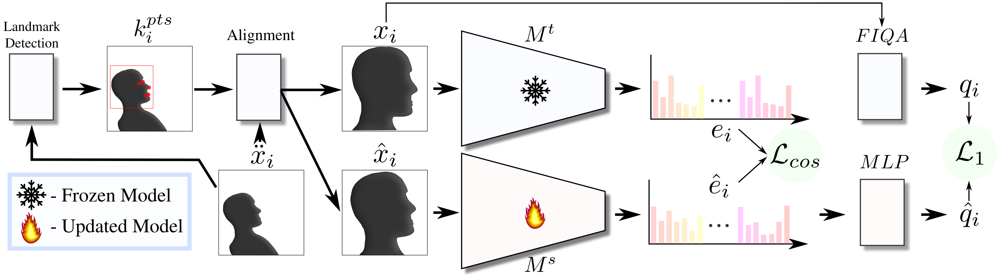
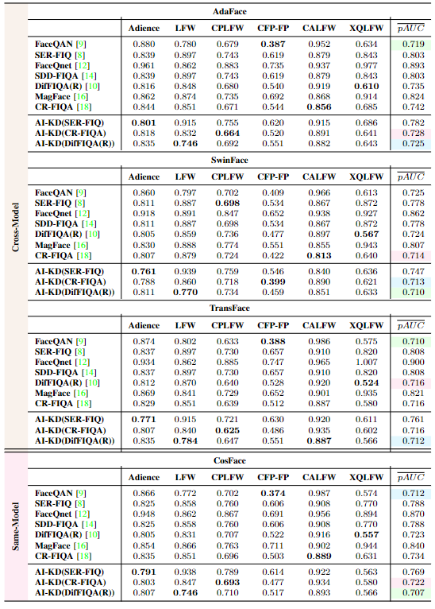
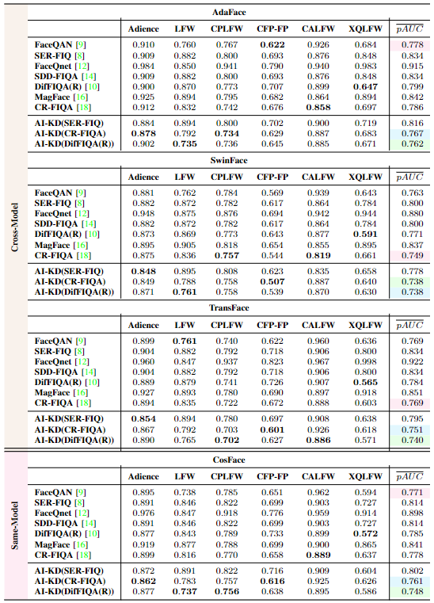

# AI-KD: Towards Alignment Invariant Face Image Quality Assessment Using Knowledge Distillation

Official repository of [__"AI-KD: Towards Alignment Invariant Face Image Quality Assessment Using Knowledge Distillation"__](https://lmi.fe.uni-lj.si/wp-content/uploads/2024/03/iwbf2024_fiq.pdf) presented at __IWBF 2024__.


# **Table of Contents**

- [**AI-KD: Towards Alignment Invariant Face Image Quality Assessment Using Knowledge Distillation** _(Official repository)_](#ai-kd)
  - [**Table of Contents**](#table-of-contents)
  - [**Method overview**](#1-method-overview)
    - [**Abstract**](#11-abstract)
    - [**Methodology**](#12-methodology)
    - [**Results**](#13-results)
  - [**Running the Code**](#2-running-the-code)
    - [**Environment Setup**](#21-environment-setup)
    - [**Inference**](#22-inference)
    - [**Training**](#23-training)
  - [**Citation**](#3-citation)


# **1. Method Overview**

## **1.1 Abstract**

Face Image Quality Assessment (FIQA) techniques have seen steady improvements over recent years, but their performance still deteriorates if the input face samples are not properly aligned. This alignment sensitivity comes from the fact that most FIQA techniques are trained or designed using a specific face alignment procedure. If the alignment technique changes, the performance of most existing FIQA techniques quickly becomes suboptimal. To address this problem, we present in this paper a novel knowledge distillation approach, termed AI-KD that can extend on any existing FIQA technique, improving its robustness to alignment variations and, in turn, performance with different alignment procedures. To validate the proposed distillation approach, we conduct comprehensive experiments on 6 face datasets with 4 recent face recognition models and in comparison to 7 state-of-the-art FIQA techniques. Our results show that AI-KD consistently improves performance of the initial FIQA techniques not only with misaligned samples, but also with properly aligned facial images. Furthermore, it leads to a new state-of-the-art, when used with a competitive initial FIQA approach. 

---

## **1.2 Methodology**



**Overview of the proposed Alignment Invariant Knowledge Distillation (AI-KD) process.** The proposed approach trains a quality-regression model, consisting of a FR backbone $M^s$ and a quality regression head $MLP$, on quality labels $q_i$ extracted using any existing FIQA approach. Training samples $\hat{x}_i$ are (mis)aligned on the fly, by perturbing the correct landmark $k^{pts}_i$ of the initial unaligned face samples $\ddot{x}_i$. Additionally, to ensure robustness to alignment variations in the distilled model, we design a distillation objective that ensures consistency between representations of the aligned $e_i$ and (mis)aligned images $\hat{e}_i$, as well as matching the predicted quality scores $\hat{q}_i$ to the quality labels $q_i$. 

---

## **1.3 Results**



**COMPARISON WITH STATE-OF-THE-ART – PROPERLY ALIGNED SAMPLES.** 



**COMPARISON WITH THE STATE-OF-THE-ART – MISALIGNED SAMPLES.** 


# **2. Running the Code**


## **2.1 Environment Setup**

> We strongly suggest using Conda to setup the necessary environment.

  1. Create and activate a new conda environment:
    ```conda create -n aikd python=3.10```
  
  2. Activate the environment:
    ```conda activate aikd```

  2. Install PyTorch using (use appropriate version of CUDA):
    ``` conda install pytorch torchvision torchaudio pytorch-cuda=11.8 -c pytorch -c nvidia ```
  
  3. Install other needed libraries:  
    ```numpy, scipy, pillow, tqdm, wandb, einops, opencv, skimage```

---

## **2.2 Inference**

__To perform quality score inference you will need to either train your own AI-KD model as described [below](#2.3-training) or download the pretrained models used in the paper, available [here](https://unilj-my.sharepoint.com/:f:/g/personal/zb4290_student_uni-lj_si/Er2YsYeGrxxChZhwDc9BhvcBKo8Uxfv25jRQnEu3CNqhPA?e=HCHKmQ).__

__Once you have an AI-KD model you can alter the inference script ./configs/inference_config.yaml.__

- Alter the image folder location (_dataset.loc_) to point to the dataset for which you want to extract quality scores.

- Possibly alter the used model (_model.config_ and _model.weight_).

- Alter the save location (_base.save\_path_) to the location where you want to save the extracted quality scores.

__Once you have configured the parameters run the inference script.__

> python3 inference.py -c ./configs/inference_config.yaml

---

## **2.3 Training**

__To train an AI-KD quality regression model first download:__ 
  - The **VGGFace2 quality scores** extracted using DifFIQA(R) and the extracted **VGGFace2 face detections** from [here](https://unilj-my.sharepoint.com/:f:/g/personal/zb4290_student_uni-lj_si/Epl46mWeChlFt-umQooMwTYBnhjYoH9QcEb4nYEsfvpJWA?e=JX29SC) and place them in "./data".

  - Additionally download the pretrained weights of the teacher ResNet100 CosFace model available [here](https://unilj-my.sharepoint.com/:f:/g/personal/zb4290_student_uni-lj_si/Er2YsYeGrxxChZhwDc9BhvcBKo8Uxfv25jRQnEu3CNqhPA?e=HCHKmQ).


__Then configure the training configuration file *./configs/train_config.yaml*.__

- Alter the save location (_save\_path_) where you wish to save the trained model.

- Alter the dataset image location (_image\_loc_) to point to the cropped VGGFace2 dataset.

- You are free to alter also the rest of the provided configuration parameters, at your own risk.

__Once you have configured the parameters run the training script.__

> python train_main.py -c ./configs/train_config.yaml


# **3. Citation**

If you use any of the code provided in this repository or find this research useful, please cite the following paper:

``` 
 @inproceedings{babnikIWBF2024,
  title={{AI-KD: Towards Alignment Invariant Face Image Quality Assessment Using Knowledge Distillation}},
  author={Babnik, {\v{Z}}iga and Boutros, Fadi and Damer, Naser and Peer, Peter and {\v{S}}truc, Vitomir},
  booktitle={Proceedings of the International Workshop on Biometrics and Forensics (IWBF)},
  year={2024},
}
``` 